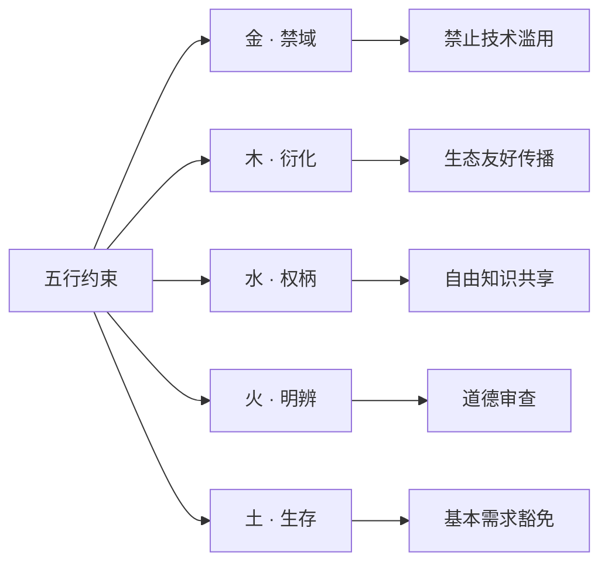

# Human Source License (HSL) | 全人类开源协议

[](LICENSE) 
[](LICENSE) 
[](LICENSE)

**五行哲学与数字文明的融合** 
面向 AI 时代的开源伦理协议

## 📜 协议文件

| 文件 | 用途 |
|------|------|
| **[LICENSE](LICENSE)** | 主协议 |
| [LICENSE_CN](LICENSE_CN) | 中文版 |
| [LICENSE_EN](LICENSE_EN) | 英文版 |

## 🚀 快速使用

### 1. 将协议添加到项目

使用主协议文件（推荐）

```bash
curl -o LICENSE https://raw.githubusercontent.com/ZhaiFanhua/Human-Source-License/main/LICENSE
```

或指定版本：

```bash
curl -o LICENSE https://raw.githubusercontent.com/ZhaiFanhua/Human-Source-License/main/LICENSE_CN
```

### 2. 在源代码中添加版权注释
```csharp
#region <<版权版本注释>>

// ----------------------------------------------------------------
// Human Source License (HSL) v1.5
// Licensed under the HSL License. See LICENSE in the project root for license information.
// FileName:SerializeExtensions
// Guid:1345864e-97d1-4fbf-8f3e-5f9d5d51176e
// Author:zhaifanhua
// Email:me@zhaifanhua.com
// CreateTime:2024/3/26 5:26:35
// ----------------------------------------------------------------

#endregion <<版权版本注释>>
```


## 🔍 协议核心要点

### 五行约束体系


### 关键特性
- **生存豁免**：满足基本需求时可暂缓原则  
- **AI 伦理**：严格禁止人格操控和大规模伤害
- **生成内容**：生成器受限，生成物自由
- **去中心化**：无需权威机构认证
- **动态平衡**：自由与责任的对立统一

## 🤝 贡献指南

欢迎通过以下方式参与改进：
```bash
# 克隆仓库
git clone https://github.com/ZhaiFanhua/Human-Source-License.git

# 创建新分支
git checkout -b improve-license

# 在 versions/ 目录提交改进
# 保持哲学版本核心精神不变
```

## 🌟 协议声明

此契无需外印。其力源于所护者——人类共命良知。
This compact requires no external validation.
Its power flows from the shared human conscience it protects.

---
**仓库地址**: [https://github.com/ZhaiFanhua/Human-Source-License](https://github.com/ZhaiFanhua/Human-Source-License)

**作者**: 摘繁华 | Zhai Fanhua

**协议版本**: 1.5 星火永续
