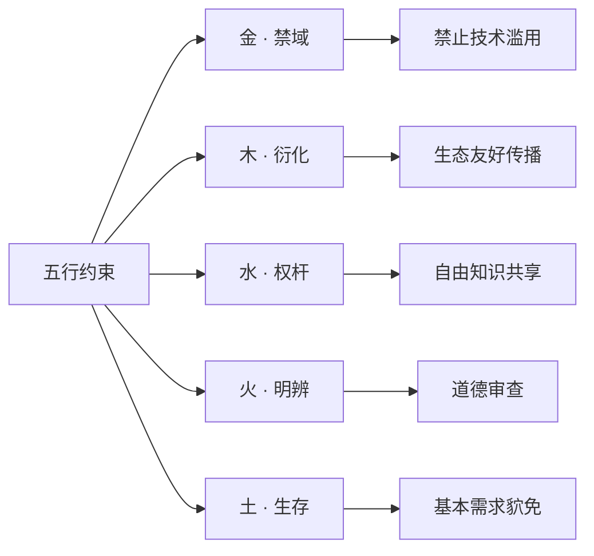

# Human Source License (HSL) | 全人类开源协议

  

**五行哲学 x 数字文明 之道**
 **面向 AI 时代的开源企业与倩理应对**

------

## 📜 协议文件

| 文件                                           | 用途   |
| ---------------------------------------------- | ------ |
| [**LICENSE**](https://chatgpt.com/c/LICENSE)   | 主协议 |
| [LICENSE_CN](https://chatgpt.com/c/LICENSE_CN) | 中文版 |
| [LICENSE_EN](https://chatgpt.com/c/LICENSE_EN) | 英文版 |

------

## 🚀 快速使用

### 1. 将协议添加到项目

使用主协议文件（推荐）

```bash
curl -o LICENSE https://raw.githubusercontent.com/ZhaiFanhua/Human-Source-License/main/LICENSE
```

或指定版本：

```bash
curl -o LICENSE https://raw.githubusercontent.com/ZhaiFanhua/Human-Source-License/main/LICENSE_CN
```

### 2. 在源代码中添加版权注释

```csharp
#region <<版权版本注释>>

// ----------------------------------------------------------------
// Human Source License (HSL) v1.5
// Licensed under the HSL License. See LICENSE in the project root for license information.
// FileName: SerializeExtensions
// Guid: 1345864e-97d1-4fbf-8f3e-5f9d5d51176e
// Author: zhaifanhua
// Email: me@zhaifanhua.com
// CreateTime: 2024/3/26 5:26:35
// ----------------------------------------------------------------

#endregion <<版权版本注释>>
```

------

## 🔍 协议核心综要

### 【五行强制体系】



### 【重要特性】

- **生存貁免** ：因生存需要可暂时断言
- **AI 倩理** ：禁止任何对人样的操控和伤害
- **生成内容** ：生成器受约束，生成物自由
- **去中心化** ：无需求件，无需承认
- **动态平衡** ：在自由与责任之间实现定子

------

## 🤝 贡献指南

欢迎以下方式参与协议的设计、维护和提升：

```bash
# 克隆仓库
git clone https://github.com/ZhaiFanhua/Human-Source-License.git

# 切换新分支
git checkout -b improve-license

# 在 versions/ 目录中提交修改
# 保持主线哲学精神不变
```

------

## 🌟 协议声明

此约，无需外印；其力，源于所护者：人类共命良知。
 **This compact requires no external validation.**
 **Its power flows from the shared human conscience it protects.**

------

**项目仓库**: https://github.com/ZhaiFanhua/Human-Source-License
**协议版本**: v1.5 星火永续
**作者**: 摘繁华
