# Human Source License (HSL)

**Wu Xing Philosophy × Digital Civilization**
 **An Open-Source Ethical Framework for the AI Era**

------

## 📜 License Files

| File                                           | Purpose       |
| ---------------------------------------------- | ------------- |
| [**LICENSE**](https://chatgpt.com/c/LICENSE)   | Main Protocol |
| [LICENSE_CN](https://chatgpt.com/c/LICENSE_CN) | Chinese       |
| [LICENSE_EN](https://chatgpt.com/c/LICENSE_EN) | English       |

------

## 🚀 Quick Start

### 1. Add the license to your project

Use the main license file (recommended):

```bash
curl -o LICENSE https://raw.githubusercontent.com/ZhaiFanhua/Human-Source-License/main/LICENSE
```

Or specify a localized version:

```bash
curl -o LICENSE https://raw.githubusercontent.com/ZhaiFanhua/Human-Source-License/main/LICENSE_EN
```

### 2. Add license comment to source code

```csharp
#region <<License Info>>

// ----------------------------------------------------------------
// Human Source License (HSL) v1.5
// Licensed under the HSL License. See LICENSE in the project root for license information.
// FileName: SerializeExtensions
// Guid: 1345864e-97d1-4fbf-8f3e-5f9d5d51176e
// Author: zhaifanhua
// Email: me@zhaifanhua.com
// CreateTime: 2024/3/26 5:26:35
// ----------------------------------------------------------------

#endregion <<License Info>>
```

------

## 🔍 Core Principles

### [Wu Xing Constraints]

```mermaid
graph LR
    A[Wu Xing Ethics] --> B[Metal · Prohibitions]
    A --> C[Wood · Evolution]
    A --> D[Water · Empowerment]
    A --> E[Fire · Discernment]
    A --> F[Earth · Survival]

    B --> G[Prohibit Tech Abuse]
    C --> H[Eco-Conscious Sharing]
    D --> I[Open Knowledge Commons]
    E --> J[Ethical Review]
    F --> K[Survival-Based Exemption]
```



### [Key Features]

- **Survival Exemption**: Temporarily override rules for survival needs
- **AI Ethics**: Strictly forbids manipulation or harm of human identity
- **Generated Content**: Generator is restricted, output is free
- **Decentralization**: No authority required for validation
- **Dynamic Balance**: Coexistence of liberty and accountability

------

## 🤝 Contributing Guide

You're welcome to participate in shaping and evolving the license:

```bash
# Clone the repo
git clone https://github.com/ZhaiFanhua/Human-Source-License.git

# Create a new branch
git checkout -b improve-license

# Submit proposals under versions/
# Preserve the core philosophical intent
```

------

## 🌟 Declaration

This license needs no seal. Its power arises from the shared conscience of humanity.
 **This compact requires no external validation.**
 **Its power flows from the shared human conscience it protects.**

------

**Repository**: https://github.com/ZhaiFanhua/Human-Source-License
**License Version**: v1.5 Eternal Ember
**Author**: ZhaiFanhua
